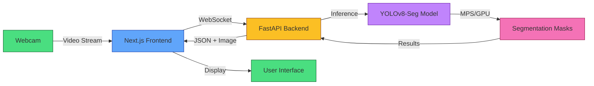
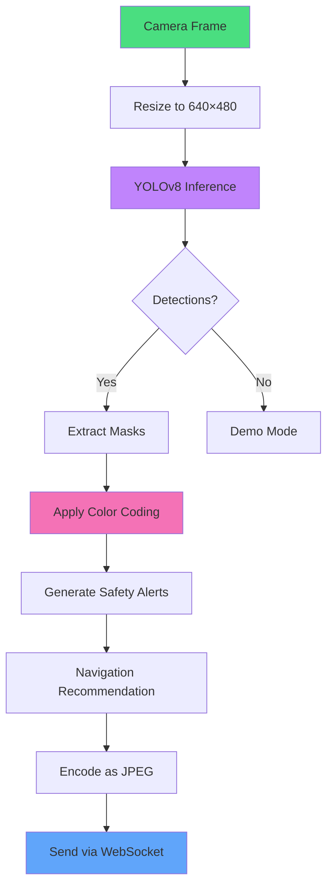

# Semantic Segmentation for Autonomous Navigation

> Teaching robots to see and understand the world around them

[](https://opensource.org/licenses/MIT)
[](https://nextjs.org/)
[](https://www.typescriptlang.org/)
[](https://www.python.org/)
[](https://fastapi.tiangolo.com/)
[](https://github.com/ultralytics/ultralytics)

---

## The Story

### Why Does This Exist?

Imagine building a delivery robot that navigates through a busy park. How does it know:
- 🚶‍♂️ **That's a person** — stop immediately
- 🐕 **That's a dog** — slow down and give space  
- 🚲 **That's a bicycle** — predict its path
- 🪑 **That's a bench** — go around it

This project solves that exact problem: a **real-time vision system** that helps autonomous robots understand what they're looking at and make safe navigation decisions.

### The Challenge

Building a vision system that works in **real-time** requires:
1. Capturing video from a camera
2. Analyzing every frame (30 times per second)
3. Identifying objects and their locations
4. Making instant decisions
5. Displaying results without lag

This system does all of that, running smoothly on a laptop.

---

## What You'll See


---

## System Architecture



### Component Breakdown

| Component | Technology | Purpose | Performance |
|-----------|------------|---------|-------------|
| **Frontend** | Next.js 16 + React | Real-time UI rendering | 60 FPS display |
| **Communication** | WebSocket | Bidirectional streaming | <50ms latency |
| **Backend** | FastAPI + Python | AI inference orchestration | 100+ req/s |
| **Model** | YOLOv8-Seg | Instance segmentation | 18ms inference |
| **Acceleration** | Apple MPS | GPU-accelerated compute | 5× speedup |

---

## How It Works

### Object Detection Pipeline



### Safety Priority System

The system classifies objects into priority levels:

| Priority | Category | Classes | Color Code | Robot Response |
|----------|----------|---------|------------|----------------|
| **P10** | Critical | `person` | `#FF0000` | Emergency stop |
| **P9** | High | `cat`, `dog`, `horse`, `cow` | `#FF8000` | High-priority avoidance |
| **P8** | High | `car`, `truck`, `bus`, `bird` | `#FFFF00` | Path planning |
| **P7** | Medium | `bicycle`, `boat`, `stop_sign` | `#00FFFF` | Traffic rules |
| **P5-6** | Medium | `traffic_light`, `fire_hydrant` | `#00FF00` | Caution |
| **P3-4** | Low | `chair`, `bench`, `backpack` | `#808080` | General avoidance |
| **P1-2** | Minimal | `potted_plant`, `bed` | `#008000` | Terrain awareness |

---

## Quick Start

### Prerequisites

- [Node.js](https://nodejs.org/) 18+ or [Bun](https://bun.sh/) 1.0+
- [Python](https://python.org/) 3.9+
- Git

### Installation

<details open>
<summary><b>1. Clone the repository</b></summary>

```bash
git clone https://github.com/tunasafa/semantic-segmentation-navigation.git
cd semantic-segmentation-navigation
```

</details>

<details>
<summary><b>2. Install frontend dependencies</b></summary>

```bash
# Using Bun (recommended)
bun install

# Or using npm
npm install
```

</details>

<details>
<summary><b>3. Install backend dependencies</b></summary>

```bash
cd mini-services/segmentation-service

# Create virtual environment
python3 -m venv ../../.venv
source ../../.venv/bin/activate  # Mac/Linux
# or
.venv\Scripts\activate  # Windows

# Install Python packages
pip install -r requirements.txt
```

</details>

<details>
<summary><b>4. Configure environment</b></summary>

```bash
# Copy example environment file
cp .env.example .env

# Edit .env with your settings (optional)
```

</details>

<details>
<summary><b>5. Start the services</b></summary>

**Terminal 1 — Backend:**
```bash
cd mini-services/segmentation-service
source ../../.venv/bin/activate
python index.py
```

**Terminal 2 — Frontend:**
```bash
bun run dev
```

Open [http://localhost:3000](http://localhost:3000)

</details>

---

## Tech Stack

### Frontend


### Backend


### Infrastructure


---

## Real-World Applications

<table>
  <tr>
    <td align="center">
      <br/>
      <sub>Hospital delivery robots</sub>
    </td>
    <td align="center">
      <br/>
      <sub>Automated inventory systems</sub>
    </td>
    <td align="center">
      <br/>
      <sub>Security and monitoring drones</sub>
    </td>
    <td align="center">
      <br/>
      <sub>Smart wheelchair navigation</sub>
    </td>
    <td align="center">
      <br/>
      <sub>Low-speed vehicle systems</sub>
    </td>
  </tr>
</table>

---

## Contributing

Contributions are welcome! Here's how you can help:

### Ways to Contribute

-  **Report bugs** 
-  **Suggest features**
-  **Improve documentation** 
-  **UI/UX improvements**
-  **Performance optimizations**

### Development Workflow

```bash
# 1. Fork and clone
git clone https://github.com/tunasafa/semantic-segmentation-navigation.git

# 2. Create a branch
git checkout -b feature/your-feature

# 3. Make changes and test
bun run lint
bun run build

# 4. Commit with clear messages
git commit -m "feat: add your feature"

# 5. Push and create PR
git push origin feature/your-feature
```

See [CONTRIBUTING.md](.github/CONTRIBUTING.md) for detailed guidelines.

---

## License

This project is open source under the [MIT License](LICENSE).

**You can:**
- ✅ Use commercially
- ✅ Modify and distribute
- ✅ Use privately

**You must:**
- 📄 Include the license
- ⚠️ No warranty provided

---

## Acknowledgments

This project builds on excellent open-source work:

- [Ultralytics YOLOv8](https://github.com/ultralytics/ultralytics) — Instance segmentation model
- [Next.js](https://github.com/vercel/next.js) — React framework
- [shadcn/ui](https://ui.shadcn.com/) — UI components
- [FastAPI](https://github.com/tiangolo/fastapi) — Python web framework

---

## Connect

<div align="center">

[](https://github.com/tunasafa)
[](https://github.com/tunasafa/semantic-segmentation-navigation)

**If you find this useful, consider giving it a ⭐**

[](https://star-history.com/#tunasafa/semantic-segmentation-navigation&Date)

---

*Built for autonomous navigation and robotics research*

</div>
